# 🏗️ **Advanced Elastic Terraform - Mermaid Architecture Diagram**

## 📊 **Complete System Architecture**

## 🔄 **Data Flow Diagram**

## 📊 **Monitoring Stack Architecture**

```mermaid
graph LR
    subgraph "🔍 Data Collection"
        ES[🔍 Elasticsearch]
        K[📊 Kibana]
        Apps[🚀 Applications]
    end
    
    subgraph "📊 Metrics Pipeline"
        Prometheus[🔍 Prometheus<br/>Metrics Collection]
        ES_Exporter[📊 ES Exporter]
        Node_Exporter[🖥️ Node Exporter]
    end
    
    subgraph "📈 Visualization"
        Grafana[📈 Grafana<br/>Dashboards]
        AlertManager[🚨 Alertmanager<br/>Alerts]
    end
    
    subgraph "🔔 Notifications"
        Email[📧 Email]
        Slack[💬 Slack]
        PagerDuty[📱 PagerDuty]
    end
    
    ES --> ES_Exporter
    K --> ES_Exporter
    Apps --> Node_Exporter
    
    ES_Exporter --> Prometheus
    Node_Exporter --> Prometheus
    
    Prometheus --> Grafana
    Prometheus --> AlertManager
    
    AlertManager --> Email
    AlertManager --> Slack
    AlertManager --> PagerDuty
```

## 🚀 **Deployment Flow**

```mermaid
flowchart TD
    A[🚀 Start Deployment] --> B{Environment?}
    
    B -->|Development| C[💻 Dev Config<br/>t3.medium, 1-2 nodes]
    B -->|Staging| D[🧪 Staging Config<br/>t3.medium, 2-3 nodes]
    B -->|Production| E[🏭 Production Config<br/>t3.large, 3+ nodes]
    
    C --> F[🔧 Terraform Init]
    D --> F
    E --> F
    
    F --> G[📋 Terraform Plan]
    G --> H{Plan Valid?}
    
    H -->|No| I[❌ Fix Issues]
    I --> G
    
    H -->|Yes| J[✅ Terraform Apply]
    J --> K[⏳ Wait for Resources]
    K --> L[🔍 Verify Deployment]
    
    L --> M{Deployment OK?}
    M -->|No| N[🚨 Troubleshoot]
    N --> L
    
    M -->|Yes| O[🎉 Success!]
    O --> P[📊 Configure Monitoring]
    P --> Q[🔐 Security Hardening]
    Q --> R[📚 Documentation]
```

## 🎯 **How to Use These Diagrams**

### **1. Mermaid (GitHub/Notion):**
- Copy the code blocks above
- Paste into GitHub markdown files
- Use in Notion with Mermaid plugin
- Embed in documentation

### **2. Draw.io:**
- Use the simplified structure below
- Import into Draw.io
- Customize colors and styling
- Export as PNG/SVG for presentations

### **3. Presentation Use:**
- **Slide 5**: Use the main architecture diagram
- **Slide 8**: Use the monitoring stack diagram
- **Slide 9**: Use the deployment flow diagram

## 🎨 **Draw.io Simplified Structure**

For Draw.io, use this simplified hierarchy:
1. **External Layer** (Users, VPN, CI/CD)
2. **Load Balancer** (ALB, Ingress)
3. **Application** (Kibana, Elasticsearch, Apps)
4. **Kubernetes** (EKS Cluster, Node Groups)
5. **Monitoring** (Prometheus, Grafana, Alerts)
6. **Storage** (EBS, S3, PVs)
7. **Networking** (VPC, Subnets, Security Groups)
8. **Cloud** (AWS)

**These diagrams will make your presentation look professional and help explain the complex architecture clearly! 🚀**
