# 🎯 **PowerPoint-Friendly Multi-Cloud Architecture Diagram**

## 📊 **Simplified Architecture for Presentations**

```mermaid
graph LR
    %% GitHub Repository
    GH[GitHub Repository<br/>elastic-terraform-demo]
    
    %% CI/CD Pipeline
    CI[GitHub Actions<br/>CI/CD Pipeline]
    
    %% Multi-Cloud Infrastructure
    subgraph "Multi-Cloud Infrastructure"
        subgraph "AWS Cloud"
            AWS[🏗️ AWS EKS<br/>Elasticsearch + Kibana<br/>$50-800/month]
        end
        
        subgraph "Azure Cloud"
            AZ[🔵 Azure AKS<br/>Elasticsearch + Kibana<br/>$40-600/month]
        end
    end
    
    %% Cross-Cloud Connection
    AWS -.->|Cross-Cloud<br/>Communication| AZ
    
    %% Environments
    subgraph "Environments"
        DEV[🏗️ Development<br/>$90-180/month<br/>15 min deploy]
        STG[🚀 Staging<br/>$270-550/month<br/>10 min deploy]
        PROD[🔒 Production<br/>$550-1400/month<br/>Manual approval]
    end
    
    %% Security & Monitoring
    SEC[🔐 Security & Monitoring<br/>X-Pack + Prometheus + Grafana]
    
    %% Connections
    GH --> CI
    CI --> AWS
    CI --> AZ
    CI --> DEV
    CI --> STG
    CI --> PROD
    
    AWS --> SEC
    AZ --> SEC
    
    %% Styling
    classDef awsStyle fill:#FF9900,stroke:#232F3E,stroke-width:3px,color:#fff,font-size:14px
    classDef azureStyle fill:#0078D4,stroke:#106EBE,stroke-width:3px,color:#fff,font-size:14px
    classDef envStyle fill:#28A745,stroke:#1E7E34,stroke-width:3px,color:#fff,font-size:14px
    classDef securityStyle fill:#DC3545,stroke:#C82333,stroke-width:3px,color:#fff,font-size:14px
    classDef repoStyle fill:#6C757D,stroke:#495057,stroke-width:3px,color:#fff,font-size:14px
    
    class AWS awsStyle
    class AZ azureStyle
    class DEV,STG,PROD envStyle
    class SEC securityStyle
    class GH,CI repoStyle
```

## 🎯 **Alternative: Even Simpler Version**

```mermaid
graph TB
    %% Main Flow
    GH[GitHub Repository] --> CI[CI/CD Pipeline]
    
    %% Multi-Cloud Deployment
    CI --> AWS[🏗️ AWS EKS<br/>Elasticsearch + Kibana]
    CI --> AZ[🔵 Azure AKS<br/>Elasticsearch + Kibana]
    
    %% Cross-Cloud
    AWS -.->|Cross-Cloud| AZ
    
    %% Environments
    CI --> DEV[🏗️ Development<br/>$90-180/month]
    CI --> STG[🚀 Staging<br/>$270-550/month]
    CI --> PROD[🔒 Production<br/>$550-1400/month]
    
    %% Security
    AWS --> SEC[🔐 Security & Monitoring]
    AZ --> SEC
    
    %% Styling
    classDef awsStyle fill:#FF9900,stroke:#232F3E,stroke-width:3px,color:#fff,font-size:16px
    classDef azureStyle fill:#0078D4,stroke:#106EBE,stroke-width:3px,color:#fff,font-size:16px
    classDef envStyle fill:#28A745,stroke:#1E7E34,stroke-width:3px,color:#fff,font-size:16px
    classDef securityStyle fill:#DC3545,stroke:#C82333,stroke-width:3px,color:#fff,font-size:16px
    classDef repoStyle fill:#6C757D,stroke:#495057,stroke-width:3px,color:#fff,font-size:16px
    
    class AWS awsStyle
    class AZ azureStyle
    class DEV,STG,PROD envStyle
    class SEC securityStyle
    class GH,CI repoStyle
```

## 🎯 **Ultra-Simple Version (Best for PowerPoint)**

```mermaid
graph LR
    GH[GitHub] --> CI[CI/CD]
    CI --> AWS[🏗️ AWS EKS<br/>$50-800/month]
    CI --> AZ[🔵 Azure AKS<br/>$40-600/month]
    AWS -.->|Cross-Cloud| AZ
    
    subgraph "Environments"
        DEV[🏗️ Dev<br/>$90-180]
        STG[🚀 Staging<br/>$270-550]
        PROD[🔒 Prod<br/>$550-1400]
    end
    
    CI --> DEV
    CI --> STG
    CI --> PROD
    
    classDef awsStyle fill:#FF9900,stroke:#232F3E,stroke-width:3px,color:#fff,font-size:18px
    classDef azureStyle fill:#0078D4,stroke:#106EBE,stroke-width:3px,color:#fff,font-size:18px
    classDef envStyle fill:#28A745,stroke:#1E7E34,stroke-width:3px,color:#fff,font-size:18px
    classDef repoStyle fill:#6C757D,stroke:#495057,stroke-width:3px,color:#fff,font-size:18px
    
    class AWS awsStyle
    class AZ azureStyle
    class DEV,STG,PROD envStyle
    class GH,CI repoStyle
```

## 📋 **PowerPoint Usage Tips:**

### **1. Choose the Right Version:**
- **Version 1**: Good balance of detail and simplicity
- **Version 2**: More compact, good for technical audiences
- **Version 3**: Ultra-simple, perfect for executive presentations

### **2. PowerPoint Integration:**
1. **Copy the Mermaid code** from your preferred version
2. **Go to** https://mermaid.live
3. **Paste the code** and render
4. **Export as PNG** (high resolution)
5. **Insert into PowerPoint** as an image

### **3. Slide Layout Suggestions:**
- **Title**: "Multi-Cloud Elasticsearch Infrastructure"
- **Subtitle**: "AWS EKS + Azure AKS Architecture"
- **Diagram**: Place in center, take up 70% of slide
- **Key Points**: Add 2-3 bullet points below diagram

### **4. Recommended Bullet Points:**
- 🌍 **Multi-Cloud**: AWS EKS + Azure AKS for high availability
- 💰 **Cost**: $90-1400/month across all environments
- 🔐 **Security**: X-Pack security across both clouds
- ⚡ **CI/CD**: Automated deployment to both clouds

## 🎨 **Customization Options:**

### **Change Colors:**
- **AWS**: `#FF9900` (current orange)
- **Azure**: `#0078D4` (current blue)
- **Environments**: `#28A745` (current green)

### **Adjust Size:**
- **Font size**: Change `font-size:16px` to your preference
- **Stroke width**: Change `stroke-width:3px` for thicker/thinner lines

These simplified versions will fit perfectly on a PowerPoint slide while still conveying your multi-cloud architecture! 🎉
