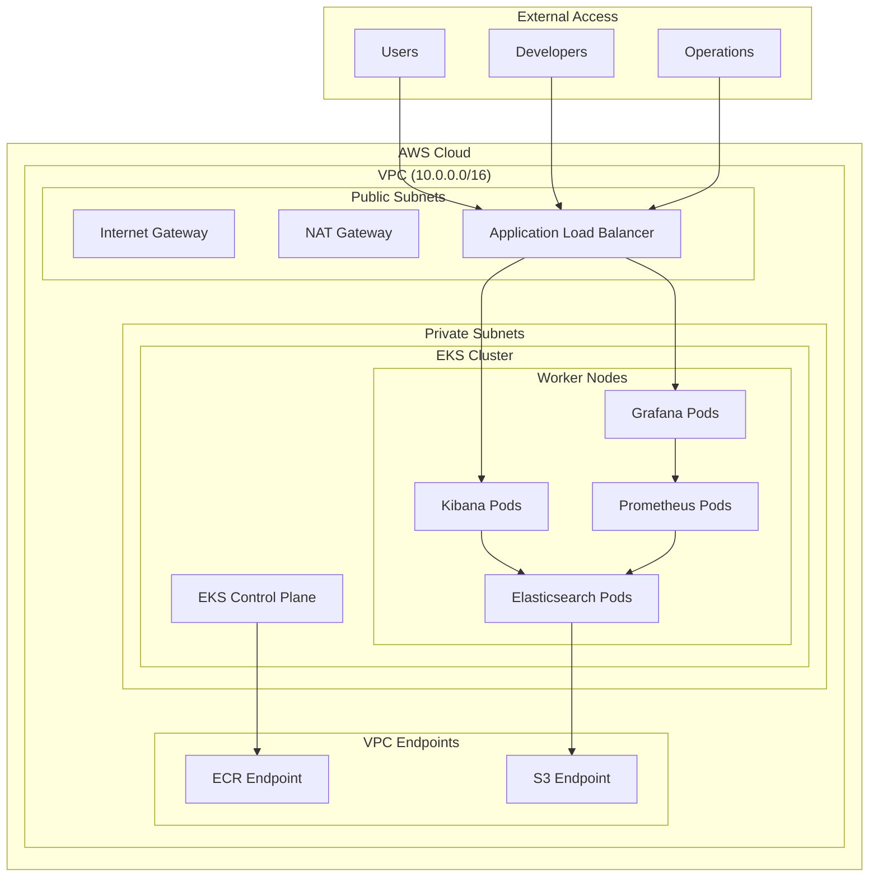

# 🚀 Elastic Stack on AWS with Terraform

A comprehensive infrastructure-as-code solution for deploying the Elastic Stack (Elasticsearch, Kibana, Grafana) on AWS EKS using Terraform. This project provides a production-ready, scalable, and secure deployment with monitoring, logging, and analytics capabilities.

## 📋 Table of Contents

- [Features](#-features)
- [Architecture](#-architecture)
- [Prerequisites](#-prerequisites)
- [Quick Start](#-quick-start)
- [Sample Data](#-sample-data)
- [Configuration](#-configuration)
- [Monitoring & Observability](#-monitoring--observability)
- [Security](#-security)
- [Troubleshooting](#-troubleshooting)
- [Contributing](#-contributing)
- [License](#-license)

## ✨ Features

### 🏗️ Infrastructure
- **AWS EKS Cluster** with managed node groups
- **Multi-AZ deployment** for high availability
- **VPC with public/private subnets** for security
- **NAT Gateways** for secure outbound connectivity
- **VPC Endpoints** for AWS services (ECR, S3)
- **Security Groups** with least-privilege access

### 📊 Elastic Stack
- **Elasticsearch 8.11.0** with full X-Pack features
- **Kibana 8.11.0** with all plugins enabled
- **Grafana** for advanced monitoring dashboards
- **Prometheus** for metrics collection
- **Machine Learning** capabilities (with license)
- **Security** and authentication features

### 🔧 DevOps & Operations
- **Terraform** for infrastructure management
- **Kubernetes** for container orchestration
- **Helm charts** for application deployment
- **Automated scaling** and health checks
- **Backup and disaster recovery** ready

## 🏛️ Architecture



## 🚀 Quick Start

### Prerequisites

1. **AWS CLI** configured with appropriate permissions
2. **Terraform** >= 1.0
3. **kubectl** for Kubernetes management
4. **Helm** for package management
5. **Git** for cloning the repository

### 1. Clone the Repository

```bash
git clone https://github.com/yourusername/elastic-terraform-aws.git
cd elastic-terraform-aws
```

### 2. Configure AWS Credentials

```bash
aws configure
# Enter your AWS Access Key ID, Secret Access Key, and region
```

### 3. Deploy Infrastructure

```bash
# Navigate to staging environment
cd environments/staging

# Initialize Terraform
terraform init

# Review the plan
terraform plan

# Deploy the infrastructure
terraform apply
```

### 4. Access Your Services

After deployment, you'll get the following URLs:

- **Kibana**: `http://your-kibana-loadbalancer-url:5601`
- **Grafana**: `http://your-grafana-loadbalancer-url:3000`
- **Elasticsearch**: `http://your-elasticsearch-internal-url:9200`

### 5. Load Sample Data

```bash
# Load ecommerce products
curl -X POST "your-elasticsearch-url:9200/_bulk" \
  -H "Content-Type: application/json" \
  --data-binary "@sample-data/ecommerce-products.json"

# Load web logs
curl -X POST "your-elasticsearch-url:9200/_bulk" \
  -H "Content-Type: application/json" \
  --data-binary "@sample-data/web-logs.json"

# Load customer orders
curl -X POST "your-elasticsearch-url:9200/_bulk" \
  -H "Content-Type: application/json" \
  --data-binary "@sample-data/customer-orders.json"

# Load system metrics
curl -X POST "your-elasticsearch-url:9200/_bulk" \
  -H "Content-Type: application/json" \
  --data-binary "@sample-data/system-metrics.json"
```

## 📊 Sample Data

This repository includes comprehensive sample data for testing and demonstration:

### E-commerce Products
- **10 products** across multiple categories
- **Fields**: name, category, price, brand, rating, description, tags
- **Use cases**: Product analytics, pricing analysis, inventory management

### Web Application Logs
- **10 log entries** with different severity levels
- **Fields**: timestamp, level, message, user_id, ip_address, response_time
- **Use cases**: Application monitoring, error tracking, performance analysis

### Customer Orders
- **5 orders** with complete transaction details
- **Fields**: order_id, customer_info, items, payment, shipping
- **Use cases**: Sales analytics, customer behavior, revenue tracking

### System Metrics
- **10 metric records** from multiple servers
- **Fields**: cpu_usage, memory_usage, disk_usage, network_io, temperature
- **Use cases**: Infrastructure monitoring, capacity planning, alerting

## ⚙️ Configuration

### Environment Variables

Create a `terraform.tfvars` file in the `environments/staging` directory:

```hcl
# AWS Configuration
aws_region = "us-west-2"
aws_profile = "default"

# EKS Configuration
cluster_name = "elastic-stack-cluster"
cluster_version = "1.29"
node_instance_types = ["t3.large"]
node_desired_size = 3
node_max_size = 5
node_min_size = 2

# Elasticsearch Configuration
elasticsearch_version = "8.11.0"
elasticsearch_storage_size = "100Gi"
elasticsearch_cpu_requests = "1000m"
elasticsearch_memory_requests = "4Gi"

# Kibana Configuration
kibana_version = "8.11.0"
kibana_cpu_requests = "500m"
kibana_memory_requests = "2Gi"

# Monitoring Configuration
enable_monitoring = true
grafana_admin_password = "your-secure-password"
```

### Customizing Deployments

You can customize the deployment by modifying the Terraform variables or Helm values:

```bash
# Customize Elasticsearch
vim environments/staging/elasticsearch-values.yaml

# Customize Kibana
vim environments/staging/kibana-values.yaml

# Customize Grafana
vim environments/staging/grafana-values.yaml
```

## 📈 Monitoring & Observability

### Built-in Dashboards

1. **Elasticsearch Cluster Health**
   - Cluster status and node health
   - Index statistics and shard distribution
   - Query performance metrics

2. **Application Logs Analysis**
   - Log level distribution
   - Error rate trends
   - Response time analysis

3. **E-commerce Analytics**
   - Product performance metrics
   - Sales trends and patterns
   - Customer behavior insights

4. **System Infrastructure**
   - CPU, memory, and disk usage
   - Network traffic patterns
   - Temperature monitoring

### Custom Dashboards

Create custom dashboards in Kibana or Grafana:

```bash
# Import sample dashboards
kubectl apply -f dashboards/kibana-dashboards.yaml
kubectl apply -f dashboards/grafana-dashboards.yaml
```

## 🔒 Security

### Network Security
- **Private subnets** for Elasticsearch and databases
- **Security groups** with restrictive rules
- **VPC endpoints** for secure AWS service access
- **NAT gateways** for controlled outbound access

### Application Security
- **TLS encryption** for all communications
- **Authentication** and authorization
- **RBAC** for Kubernetes resources
- **Secrets management** with AWS Secrets Manager

### Data Protection
- **Encryption at rest** for all data
- **Encryption in transit** for all communications
- **Backup and recovery** procedures
- **Audit logging** for compliance

## 🛠️ Troubleshooting

### Common Issues

#### 1. EKS Cluster Not Ready
```bash
# Check cluster status
aws eks describe-cluster --name your-cluster-name --region your-region

# Check node group status
aws eks describe-nodegroup --cluster-name your-cluster-name --nodegroup-name your-nodegroup-name
```

#### 2. Pods Not Starting
```bash
# Check pod status
kubectl get pods --all-namespaces

# Check pod logs
kubectl logs -n elasticsearch deployment/elasticsearch
kubectl logs -n kibana deployment/kibana
```

#### 3. Elasticsearch Connection Issues
   ```bash
# Test Elasticsearch connectivity
kubectl port-forward -n elasticsearch svc/elasticsearch 9200:9200
curl http://localhost:9200/_cluster/health
```

#### 4. Kibana Not Loading
```bash
# Check Kibana logs
kubectl logs -n kibana deployment/kibana

# Verify Elasticsearch connection
kubectl exec -n kibana deployment/kibana -- curl http://elasticsearch.elasticsearch.svc.cluster.local:9200
```

### Debugging Commands

   ```bash
# Get all resources
kubectl get all --all-namespaces

# Check service endpoints
kubectl get endpoints --all-namespaces

# Check persistent volumes
kubectl get pv,pvc --all-namespaces

# Check ingress
kubectl get ingress --all-namespaces
```

## 📚 Additional Resources

### Documentation
- [Elasticsearch Documentation](https://www.elastic.co/guide/en/elasticsearch/reference/current/index.html)
- [Kibana User Guide](https://www.elastic.co/guide/en/kibana/current/index.html)
- [Grafana Documentation](https://grafana.com/docs/)
- [Terraform AWS Provider](https://registry.terraform.io/providers/hashicorp/aws/latest/docs)

### Tutorials
- [Getting Started with Elasticsearch](https://www.elastic.co/guide/en/elasticsearch/reference/current/getting-started.html)
- [Kibana Dashboard Creation](https://www.elastic.co/guide/en/kibana/current/dashboard.html)
- [Grafana Dashboard Import](https://grafana.com/docs/grafana/latest/dashboards/import-dashboard/)

## 🤝 Contributing

We welcome contributions! Please see our [Contributing Guide](CONTRIBUTING.md) for details.

### Development Setup

1. Fork the repository
2. Create a feature branch
3. Make your changes
4. Add tests if applicable
5. Submit a pull request

### Reporting Issues

Please use the [GitHub Issues](https://github.com/yourusername/elastic-terraform-aws/issues) page to report bugs or request features.

## 📄 License

This project is licensed under the MIT License - see the [LICENSE](LICENSE) file for details.

## 🙏 Acknowledgments

- [Elastic](https://www.elastic.co/) for the amazing Elastic Stack
- [Grafana Labs](https://grafana.com/) for the monitoring platform
- [HashiCorp](https://www.hashicorp.com/) for Terraform
- [AWS](https://aws.amazon.com/) for the cloud infrastructure

## 📞 Support

- **Documentation**: [Wiki](https://github.com/yourusername/elastic-terraform-aws/wiki)
- **Issues**: [GitHub Issues](https://github.com/yourusername/elastic-terraform-aws/issues)
- **Discussions**: [GitHub Discussions](https://github.com/yourusername/elastic-terraform-aws/discussions)

---

**⭐ If you found this project helpful, please give it a star!**