# 🌍 **Multi-Cloud Elasticsearch & Terraform Infrastructure Architecture**

## 📊 **Updated Architecture Diagram (Mermaid)**

```mermaid
graph TB
    %% GitHub Repository & CI/CD Pipeline
    subgraph "GitHub Repository & CI/CD"
        GH[GitHub Repository<br/>elastic-terraform-demo]
        CI[GitHub Actions<br/>CI/CD Pipeline]
        DEV_BRANCH[Develop Branch]
        MAIN_BRANCH[Main Branch]
        
        GH --> CI
        CI --> DEV_BRANCH
        CI --> MAIN_BRANCH
        
        %% CI/CD Validation Steps
        subgraph "Validation Steps"
            SECURITY[Security Scan<br/>Trivy]
            TF_VALID[Terraform<br/>Validation]
            HELM_VALID[Helm<br/>Validation]
        end
        
        CI --> SECURITY
        CI --> TF_VALID
        CI --> HELM_VALID
    end
    
    %% AWS Cloud Infrastructure
    subgraph "AWS Cloud Infrastructure"
        subgraph "AWS EKS Cluster"
            AWS_VPC[AWS VPC<br/>10.0.0.0/16]
            AWS_EKS[AWS EKS<br/>Kubernetes Cluster]
            AWS_ES[AWS Elasticsearch<br/>Nodes]
            AWS_KI[AWS Kibana<br/>Nodes]
            AWS_MON[AWS Monitoring<br/>Stack]
        end
        
        AWS_VPC --> AWS_EKS
        AWS_EKS --> AWS_ES
        AWS_EKS --> AWS_KI
        AWS_EKS --> AWS_MON
    end
    
    %% Azure Cloud Infrastructure
    subgraph "Azure Cloud Infrastructure"
        subgraph "Azure AKS Cluster"
            AZ_RG[Azure Resource Group<br/>multi-cloud-elastic-rg]
            AZ_VNET[Azure VNet<br/>10.1.0.0/16]
            AZ_AKS[Azure AKS<br/>Kubernetes Cluster]
            AZ_ES[Azure Elasticsearch<br/>Nodes]
            AZ_KI[Azure Kibana<br/>Nodes]
            AZ_MON[Azure Monitoring<br/>Stack]
        end
        
        AZ_RG --> AZ_VNET
        AZ_VNET --> AZ_AKS
        AZ_AKS --> AZ_ES
        AZ_AKS --> AZ_KI
        AZ_AKS --> AZ_MON
    end
    
    %% Cross-Cloud Communication
    AWS_ES -.->|Cross-Cloud<br/>Communication| AZ_ES
    AWS_KI -.->|Load Balanced<br/>Traffic| AZ_KI
    
    %% Environments
    subgraph "Multi-Cloud Environments"
        subgraph "Development Environment"
            DEV_AWS[🏗️ AWS Dev<br/>2 t3.medium nodes<br/>50Gi storage<br/>$50-100/month<br/>15 min deploy]
            DEV_AZ[🏗️ Azure Dev<br/>2 Standard_B2s nodes<br/>50Gi storage<br/>$40-80/month<br/>15 min deploy]
        end
        
        subgraph "Staging Environment"
            STG_AWS[🚀 AWS Staging<br/>3 t3.large nodes<br/>100Gi storage<br/>$150-300/month<br/>10 min deploy]
            STG_AZ[🚀 Azure Staging<br/>3 Standard_B4ms nodes<br/>100Gi storage<br/>$120-250/month<br/>10 min deploy]
        end
        
        subgraph "Production Environment"
            PROD_AWS[🔒 AWS Production<br/>5+ m5.large+ nodes<br/>200Gi storage<br/>$300-800/month<br/>Manual approval]
            PROD_AZ[🔒 Azure Production<br/>5+ Standard_D4s_v3+ nodes<br/>200Gi storage<br/>$250-600/month<br/>Manual approval]
        end
    end
    
    %% Security & Monitoring
    subgraph "Security & Monitoring"
        SEC[🔐 X-Pack Security<br/>Cross-Cloud Authentication]
        MON[📊 Monitoring Stack<br/>Prometheus + Grafana]
        BACKUP[💾 Backup & DR<br/>Cross-Cloud Replication]
        LB[⚖️ Load Balancer<br/>Traffic Distribution]
    end
    
    %% Cost Summary
    subgraph "Multi-Cloud Cost Estimates"
        COST_DEV[Development: $90-180/month<br/>AWS: $50-100 + Azure: $40-80]
        COST_STG[Staging: $270-550/month<br/>AWS: $150-300 + Azure: $120-250]
        COST_PROD[Production: $550-1400/month<br/>AWS: $300-800 + Azure: $250-600]
    end
    
    %% Connections
    CI --> DEV_AWS
    CI --> DEV_AZ
    CI --> STG_AWS
    CI --> STG_AZ
    CI --> PROD_AWS
    CI --> PROD_AZ
    
    AWS_ES --> SEC
    AZ_ES --> SEC
    AWS_MON --> MON
    AZ_MON --> MON
    AWS_ES --> BACKUP
    AZ_ES --> BACKUP
    
    LB --> AWS_KI
    LB --> AZ_KI
    
    %% Styling
    classDef awsStyle fill:#FF9900,stroke:#232F3E,stroke-width:2px,color:#fff
    classDef azureStyle fill:#0078D4,stroke:#106EBE,stroke-width:2px,color:#fff
    classDef envStyle fill:#28A745,stroke:#1E7E34,stroke-width:2px,color:#fff
    classDef securityStyle fill:#DC3545,stroke:#C82333,stroke-width:2px,color:#fff
    classDef costStyle fill:#6F42C1,stroke:#5A2D82,stroke-width:2px,color:#fff
    
    class AWS_VPC,AWS_EKS,AWS_ES,AWS_KI,AWS_MON awsStyle
    class AZ_RG,AZ_VNET,AZ_AKS,AZ_ES,AZ_KI,AZ_MON azureStyle
    class DEV_AWS,DEV_AZ,STG_AWS,STG_AZ,PROD_AWS,PROD_AZ envStyle
    class SEC,MON,BACKUP securityStyle
    class COST_DEV,COST_STG,COST_PROD costStyle
```

## 🎯 **Key Features of This Updated Diagram:**

### **🌍 Multi-Cloud Architecture:**
- **AWS EKS** + **Azure AKS** running simultaneously
- **Cross-cloud communication** between Elasticsearch nodes
- **Load-balanced traffic** distribution across clouds

### **🏗️ Environment Strategy:**
- **Development**: Both clouds for testing multi-cloud features
- **Staging**: Full multi-cloud deployment for validation
- **Production**: Enterprise-grade multi-cloud with manual approval

### **💰 Updated Cost Estimates:**
- **Development**: $90-180/month (AWS + Azure)
- **Staging**: $270-550/month (AWS + Azure)
- **Production**: $550-1400/month (AWS + Azure)

### **🔐 Security & Monitoring:**
- **X-Pack Security** across both clouds
- **Unified monitoring** stack
- **Cross-cloud backup** and disaster recovery

### **⚡ CI/CD Pipeline:**
- **Multi-cloud deployment** automation
- **Validation steps** for both AWS and Azure
- **Environment-specific** configurations

## 🚀 **Benefits of This Multi-Cloud Approach:**

1. **High Availability**: If one cloud fails, the other continues serving
2. **Geographic Distribution**: Better performance for global users
3. **Risk Mitigation**: No single cloud dependency
4. **Cost Optimization**: Choose best pricing between clouds
5. **Compliance**: Meet multi-cloud requirements

## 📋 **How to Use This Diagram:**

1. **Copy the Mermaid code** from the code block above
2. **Paste into any Mermaid-compatible tool** (GitHub, GitLab, Mermaid Live Editor)
3. **Customize colors and styling** as needed
4. **Export as PNG/SVG** for presentations and documentation

This diagram now accurately represents your **full multi-cloud Elasticsearch infrastructure** with both AWS and Azure components! 🎉
